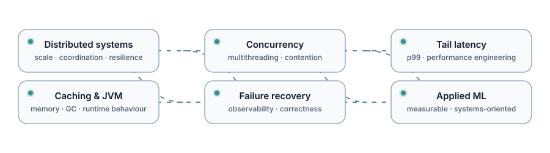

  

I build **high-throughput, failure-tolerant systems** for workloads where latency, scale and reliability matter.

---

## ⚡ Engineering impact

I’m a Senior Software Engineer at **ION Trading**, working on production systems where concurrency, latency, large data volumes, failure recovery and operational correctness matter.

- Led a Java multithreading refactor that improved end-of-day trade processing by **20×**.
- Built an off-heap persistent caching solution that accelerated supported workflows by **up to 50×**.
- Automated recovery for halted processing, reducing operational downtime by **90%**.
- Built tooling for **100 GB+ production logs**, reducing incident-triage time by **30%**.
- Improved CI build time by **40%** while reducing AWS cost by **35%**.

---

## 🔭 Current focus

### [TailCache](https://github.com/Enixes/TailCache) · Tail-Latency Trade-offs in Java Caching

      

A reproducible systems benchmarking project comparing **on-heap and off-heap Java caching** under controlled workloads, with emphasis on latency distributions rather than headline throughput.

Current questions include:

- how payload size changes cache-operation latency;
- how on-heap and off-heap access differ at **p50 / p95 / p99 / p99.9**;
- how GC pressure and value materialization affect tail behaviour;
- whether observed differences remain stable across repeated runs.

---

## 🧩 Selected work

| Project / system | Focus |
|---|---|
| **[TailCache](https://github.com/Enixes/TailCache)** | Java 21 · JMH · tail latency · JVM memory behaviour · reproducible benchmarking |
| **Trading platform · ION** | High-throughput EOD processing · multithreading · event-driven workflows · failure recovery |
| **Off-heap persistent caching · ION** | Removing inter-process calls · large performance improvements · memory architecture |
| **Production analysis tooling** | Large-scale log parsing · incident diagnosis · production observability |
| **[Hybrid Social Group Optimization](https://github.com/Enixes/Hybrid-Social-Group-Optimization-algorithm)** | Optimization · ML · medical-image classification · peer-reviewed research |
| **Portfolio — [Live](https://asusingh.vercel.app) · [Source](https://github.com/Enixes/portfolio-next)** | Interactive engineering portfolio · Next.js · React |

---

## 📚 Research

### COVID-19 Infection Detection from Chest X-Ray Images Using Hybrid Social Group Optimization and Support Vector Classifier

**Cognitive Computation · Springer**

Peer-reviewed work applying a hybrid meta-heuristic optimization technique to medical-image classification.

**[Paper](https://link.springer.com/article/10.1007/s12559-021-09848-3)** · **[Code](https://github.com/Enixes/Hybrid-Social-Group-Optimization-algorithm)**

---

## 🛠️ Stack

### Systems & backend

### Data, infrastructure & observability

---

## 🧠 Problems I like working on

  

I’m especially interested in systems questions where **average-case performance hides the real operational story**.

---

